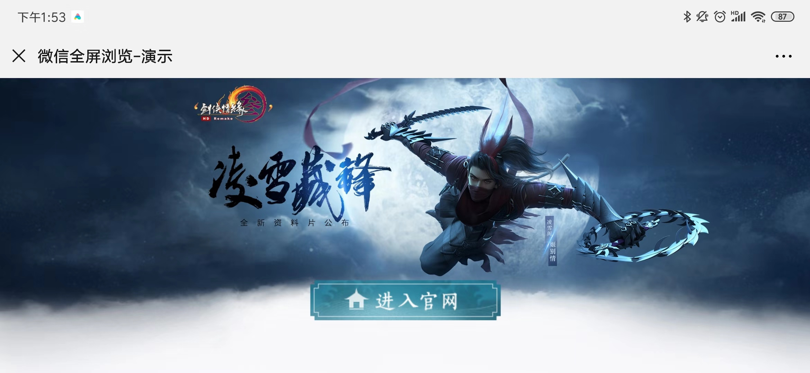
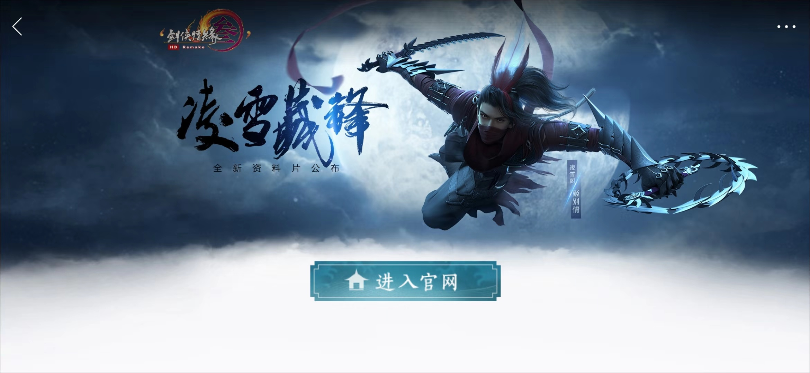

# wx-fullpage

> 实现微信全屏模式

[](https://www.npmjs.com/package/wx-fullpage) [](https://standardjs.com)

## [demo](https://browniu.com/wx-fullpage/)
未开启全屏时顶部状态栏占据了近15%-20%的屏幕高度



开启全屏模式可以提高页面的整体观感



开启过程


## Install

```bash
npm install --save wx-fullpage
```

## Usage

```jsx
import React, { Component } from 'react'

import Fullpage from 'wx-fullpage'

class Fullpage extends Component {
  render () {
    return (
        <Fullpage>
          <div className='main'>
            hello browniu
          </div>
        </Fullpage>
    )
  }
}
```

## License

MIT © [github.com/browniu](https://github.com/github.com/browniu)
